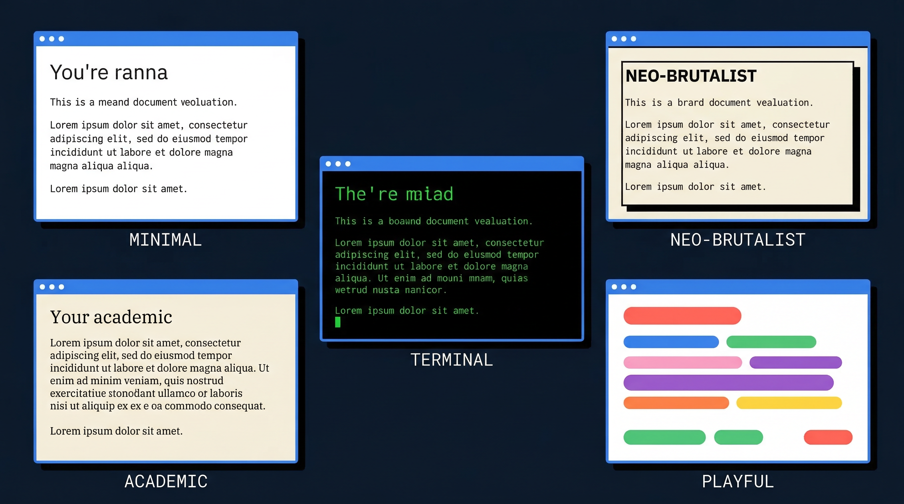
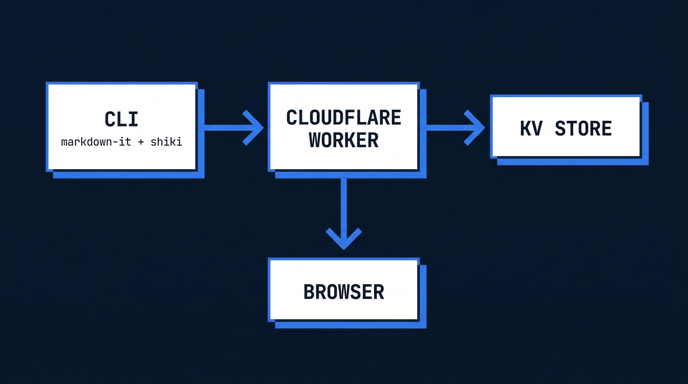

<p align="center">
  
</p>

<h1 align="center">mDrop</h1>

<p align="center">
  <strong>One command. Instant page.</strong><br />
  Turn any markdown file into a beautifully styled, shareable webpage.
</p>

<p align="center">
  <a href="https://github.com/vincenthopf/mdrop/blob/main/LICENSE"></a>
  <a href="https://www.npmjs.com/package/mdrop"></a>
</p>

<p align="center">
  
</p>

---

## What is mDrop?

mDrop is a CLI tool that takes a markdown file, renders it as a beautifully styled HTML page, and gives you a shareable URL — all in one command.

```bash
$ mdrop README.md --theme brutalist
Rendering with brutalist theme...
Uploading...

https://mdrop.workers.dev/a1b2c3d4
```

- **Pre-rendered HTML** — All rendering happens locally. Pages load instantly.
- **5 built-in themes** — Clean, Brutalist, Terminal, Academic, Playful.
- **Configurable expiry** — Links expire in 1h, 7d, 30d, or never.
- **Self-hosted** — Runs on your own Cloudflare Workers account. Free tier. $0.
- **Open source** — MIT licensed. Fork it, extend it, own it.

## Quick Start

### 1. Deploy the Worker

Click the button to deploy mDrop to your Cloudflare account:

[](https://deploy.workers.cloudflare.com/?url=https://github.com/vincenthopf/mdrop/tree/main/worker)

Then set your API key:

```bash
cd worker
wrangler secret put API_KEY
# Enter a secret key — you'll use this to authenticate uploads
```

### 2. Install the CLI

```bash
npm install -g mdrop
```

### 3. Configure

```bash
mdrop init
# Enter your Worker URL and API key
```

### 4. Share

```bash
mdrop file.md                          # Clean theme, 7-day expiry
mdrop file.md --theme brutalist        # Choose a theme
mdrop file.md --expires 30d            # Set link expiry
mdrop file.md --expires never          # Permanent link
```

## Themes

Choose a theme with `--theme <name>`. Every page is fully self-contained — CSS inlined, zero external requests.

<p align="center">
  
</p>

| Theme | Flag | Description |
|-------|------|-------------|
| **Clean** | `--theme clean` | Sans-serif, minimal, light/dark mode. The default. |
| **Brutalist** | `--theme brutalist` | Monospace, hard borders, offset shadows. Neo-brutalist. |
| **Terminal** | `--theme terminal` | Green on black, scanlines. Hacker aesthetic. |
| **Academic** | `--theme academic` | Serif fonts, paper background. LaTeX-inspired. |
| **Playful** | `--theme playful` | Rounded, colorful, friendly. |

## Commands

| Command | Description |
|---------|-------------|
| `mdrop <file>` | Share a markdown file |
| `mdrop init` | Configure Worker URL and API key |
| `mdrop list` | List your shared pages |
| `mdrop delete <id>` | Delete a shared page |
| `mdrop preview <file>` | Preview locally before sharing |
| `mdrop --help` | Show help |

### Flags

| Flag | Short | Default | Description |
|------|-------|---------|-------------|
| `--theme` | `-t` | `clean` | Theme name |
| `--expires` | `-e` | `7d` | Link expiry (`1h`, `7d`, `30d`, `never`) |

## Architecture

<p align="center">
  
</p>

mDrop is two things:

1. **CLI** (Node.js) — Parses markdown with [markdown-it](https://github.com/markdown-it/markdown-it), highlights code with [Shiki](https://shiki.style/), wraps in themed HTML, uploads.
2. **Worker** (~50 lines of JS) — Stores HTML in Cloudflare KV, serves it. That's it.

All rendering happens on your machine. The Worker is a trivial static file server. Deploy it once, push content forever — no rebuilds.

<p align="center">
  
</p>

### Tech Stack

| Component | Choice |
|-----------|--------|
| Markdown parser | [markdown-it](https://github.com/markdown-it/markdown-it) |
| Syntax highlighting | [Shiki](https://shiki.style/) (inline styles, VS Code accuracy) |
| TOC generation | [markdown-it-anchor](https://github.com/valeriangalliat/markdown-it-anchor) + [markdown-it-toc-done-right](https://github.com/nagaozen/markdown-it-toc-done-right) |
| Hosting | [Cloudflare Workers](https://workers.cloudflare.com/) + [KV](https://developers.cloudflare.com/kv/) |
| Link expiry | Native KV TTL (no cleanup logic) |

### Free Tier Limits

| Resource | Limit |
|----------|-------|
| Worker requests | 100,000/day |
| KV reads | 100,000/day |
| KV writes | 1,000/day |
| KV storage | 1 GB |

## Manual Deploy

If you prefer manual setup over the deploy button:

```bash
# Authenticate with Cloudflare (one-time)
wrangler login

# Clone and enter the worker directory
git clone https://github.com/vincenthopf/mdrop
cd mdrop/worker

# Create a KV namespace and copy the ID
wrangler kv namespace create "PAGES"
# Output: { id: "your-namespace-id" }

# Uncomment the [[kv_namespaces]] block in wrangler.toml
# and paste the namespace ID

# Set your API key and deploy
wrangler secret put API_KEY
wrangler deploy
```

## Project Structure

```
mdrop/
├── cli/                    # CLI tool
│   ├── bin/mdrop.js        # Entry point
│   ├── src/
│   │   ├── index.js        # Arg parsing, commands
│   │   ├── render.js       # markdown-it + shiki pipeline
│   │   ├── template.js     # HTML wrapper
│   │   ├── upload.js       # Worker API client
│   │   ├── config.js       # ~/.config/mdrop/config.json
│   │   └── themes/         # 5 CSS themes
│   └── package.json
├── worker/                 # Cloudflare Worker
│   ├── src/index.js        # ~50 lines: POST/GET/DELETE/LIST
│   ├── wrangler.toml
│   └── package.json
└── site/                   # Landing page (Astro)
```

## Contributing

Contributions welcome. Please open an issue first to discuss what you'd like to change.

## License

[MIT](LICENSE)
